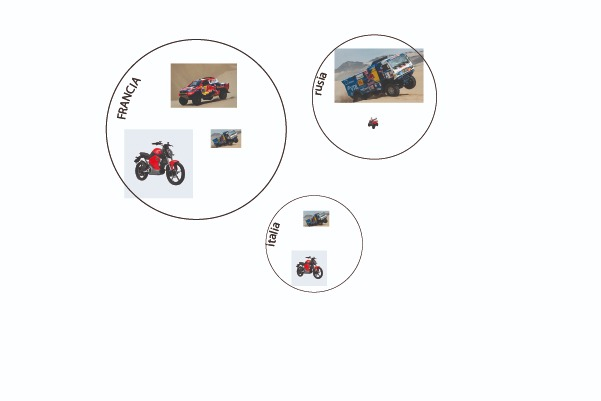

# Clase 2: Avances
*En este documento se realizará un desarrollo de los contenidos y temas a tratar en nuestra página web. Escogimos como tema de trabajo el impacto del [Rally Dakar](https://www.dakar.com/es/universo-dakar/lacarrera) en zonas naturales y patrimoniales del país.*

## ESTRUCTURA

1. Contexto: Qué es y su historia
2. Impacto: Beneficios y desventajas 
3. El caso de Chile: impacto en el país
4. El caso de Perú: ejemplo de conservación patrimonial
5. Conclusiones

## INFOGRAFÍA MAQUETA
   
   
### Infografías

1. Diagrama que muestra la información de cuántos son los concursantes y sus países. Según el tamaño del circulo grande y el tamaño de los iconos de cada vehículo, el usuario puede entender de manera fácil y rápida cuáles son los países con más presencia en la carrera y los ganadores de esta.
2. Diagrama u infografia que muestra como cada vehículo genera un impacto en el medio ambiente, pero además como afecta el volumen total de vehículos que abarcan la carrera, ya que si bien las motos, por ejemplo, tienen menos impacto, su volumen es mayor, por lo que el impacto final en la carrera es más grande.
3. GIF que muestra y comparar las dos rutas desde 1978 hasta hoy. Se pretende entregar contexto, en diferentes cuadros de gif, sobre las rutas de la carrera y cómo se abarca en los diferentes países.
4. Gráfico que muestra el impacto del Dakar en la economía, específicamente en el turismo de la zona. Mediante las líneas punteadas se indican los puntos clave en donde la economía tuvo un progreso debido a la actividad turística en la zona.
5. Esquema o infografía que muestra la cantidad de fallecidos en las carreras, haciendo la diferencia mediante los colores entre los concursantes, accidentados y muertos. Asi se puede entender el riesgo que conllevan las carreras.
6. Gráfico que muestra las tipologías de tipos de patrimonios en Chile para así dar un contexto sobre cómo funciona o se clasifica el patrimonio en nuestro país.
7. Esquema o diagrama que mediante los puntos de colores nos índica los monumentos patrimoniales que existen en el país. Se destaca en la zona norte (una de las más afectadas por el Dakar) como una de las zonas con más elementos patrimoniales del país.
8. A partir del esquema anterior, se incluye la ruta de la carrera para poder entender que esta pasa por encima u entremedio de los elementos patrimoniales ubicados en la zona.
9. Esquema que muestra la ruta de la carrera realizada en Perú y cómo ésta evita o esquiva  o incorpora adecuadamente los elementos o zonas de interés patrimonial que se encuentran en la zona, siendo un ejemplo ya que evita el daño de estas zonas.
10. GIF que muestra el daño que se produce en los geoglifos debido a las huellas de vehículos. Mediante los diferentes cuadros del GIF se busca mostrar como el geoglifo, debido a su antigüedad y años que tiene, se va desapareciendo de la tierra, mientras que las huellas de los vehículos se mantienen debido a las características del desierto.

### Links

https://pueblosoriginarios.com/sur/andina/atacama/geoglifos.html#:~:text=Los%20geoglifos%20de%20Atacama&text=Al%20norte%20de%20Chile%2C%20en,los%20cerros%2C%20conocidas%20como%20geoglifos.&text=Un%20tercer%20grupo%20de%20geoglifos,mixto%20de%20extracci%C3%B3n%20y%20adici%C3%B3n.   
   
## INFORMACIÓN 

### El impacto del Dákar en el patrimonio material del desierto de Atacama.

#### Contexto
##### Que és y su historia
El Dakar es la carrera rally raid (de campo, sin ruta) más grande del mundo, caracterizada por su condición de aventura extrema y la necesidad de habilidades de orientación y navegación. Dura aproximadamente entre 10 a 15 días y se desarrolla entre diciembre y enero de cada año y participan alrededor de 500 personas de más de 60 nacionalidades, que compiten en diferentes categorías según sus vehículos; motos, autos, quad y camiones.

*infografía 1: sobre los concursantes, su nacionalidad y tipo de vehículo.*
      
      
 *Diagrama que muestra la información de cuantos son los corcunsantes y sus paises. Según el tamaño del circulo grande y el tamaño de los iconos de cada vehiculo, el usuario puede entender de manera fácil y rápida cuáles son los países con más presencia en la carrera y los ganadores de esta.*

*infografía 2: sobre las diferencias en los vehículos y su impacto.* 
      
     
*Diagrama u infografia que muestra como cada vehiculo genera un impacto en el medio ambiente, pero además como afecta el volumen total de vehiculos que abarcan la carrera, ya que si bien las motos, por ejemplo, tienen menos impacto, su volumen es mayor, por lo que el impacto final en la carrera es más grande.*

Esta carrera partió desarrollándose desde Europa a África, el año 1978, después de que el piloto francés Thierry Sabine se perdiera en el norte de África. Se desarrolló por décadas entre Europa y África, partiendo y terminando en distintas ciudades de estos continentes. Para el 2009 se cambió de lugar por problemas de [ataques terroristas](https://www.biobiochile.cl/noticias/2012/12/30/por-que-el-dakar-dejo-africa-y-se-vino-a-correr-a-sudamerica.shtml) tras el surgimiento de Al Qaeda. Se desarrolló en sudámerica desde el 2009 hasta el 2019, y pasó por Chile, Argentina, Perú y Bolivia. Des este se desarrolla en Arabia Saudita.

*infografía 3: comparación de rutas africa-europa y sudamérica (quizás también con las nuevas de Arabia Saudita).*
      

*GIF que muestra y comparar las dos rutas desde 1978 hasta hoy. Se pretende entregar contexto, en diferenctes cuadros de gif, sobre las rutas de la carrera y como se abarca en los diferentes paises.* 

### Impacto
#### Beneficios y desventajas del Dakar
El rally Dakar es una de las carreras más populares y vistas, siendo transmitida en 190 países alcanzando 95 millones de espectadores. Durante los años que ocurrió esta carrera en Sudamérica, se realizaron distintas rutas en los países antes mencionados, teniendo impactos positivos y negativos.

- La carrera atrae muchos espectadores presenciales, lo que estimula el consumo local en alojamiento, comercio, combustible y otros servicios, siendo una activación importante en la economía de las regiones por donde pasa la ruta.

*infografía 4: impacto positivo en la economía, mostrando cifras*
      
    
*Gráfico que muestra el impacto del Dakar en la economía, específicamente en el turismo de la zona. Mediante las líneas punteadas se indican los puntos clave en donde la economía tuvo un progreso debido a la actividad turistica en la zona.*

- Por otra parte, el impacto mediático y la transmición del evento, muestran el patrimonio natural y cultural de las rutas, promoviendo el turismo.

- Esta es muy peligrosa, pone en peligro la vida de los partipantes, pero también de los espectadores que se exponen estando en las rutas por donde pasan los vehículos. Desde sus comienzos hasta el 2016 han fallecido [65 personas](https://www.lainformacion.com/deporte/la-cifra-de-muertos-en-el-dakar-se-eleva-hasta-65-con-nueve-ninos-entre-ellos_u54iBWqIKhV1CbGTQlhwP5/) en este evento.

*infografía 5: numero de accidentados y muertes en la historia del dakar*
      
      
*Esquema o infografía que muestra la cantidad de fallecidos en las carreras, haciendo la diferencia mediante los colores entre los concursantes, accidentados y muertos. Asi se puede entender el riesgo que conllevan las carreras.* 

- La carrera se desarrolla sin una ruta específica, sino que a campo travieso pasando por ciertos puntos específicos para completar la carrera. Estos significa que los participantes generan un impacto en los recorridos que realizan afectando los recursos naturales.

#### El caso de Chile
##### El impacto del Dakar nacionalmente

En Chile, las rutas han afectado zonas donde se encuentra patrimonio natural y cultural. 
- Qué se entiende por patrimonio (definición)
- Que ocurre con el patrimonio a nivel nacional (tenemos abundante patrimonio cultural y natural (por qué; aridez del desierto lo protege), cuál es la perspectiva oficial nacional con respecto a la conservación patrimonial).

*Infografía 6: Mostrar el tipo de patrimonio en Chile; tipos de sitios o tipo de patrimonio (material-inmaterial)*
      
      
 *Gráfico que muestra las tipologias de tipos de patrimonios en Chile para así dar un contexto sobre como funciona o se clasifica el patrimonio en nuestro país.*
 
*Infografía 7: mostrar pq hay tanto patrimonio en el desierto, y por lo tanto, por qué resguardarlo*
      
      
 *Esquema o diagrama que mediante los puntos de colores nos índica los monumentos patrimoniales uqe existen en el país. Se destaca en la zona norte (una de las más afectadas por el Dakar) como una de las zonas con más elementos patrimoniales del país.* 
 
*Infografía 8: Mostrar las rutas con un mapa que tambien incorpora las zonas de interés patrimonial*
      
      
*A partir del esquema anterior, se incluye la ruta de la carrera para poder entender que esta pasa por encima u entremedio de los elementos patrimoniales ubicados en la zona.*

Consecuencias "reales":
- daño a elementos arqueológicos, tales como los geoglifos, en la zona norte de nuestro país, que debido a las rutas libres creadas por los propios pilotos, corren el riesgo de ser pulverizados por los vehículos. 
- las huellas se mantienen por tiempo indefinido debido a las características áridas del desierto.
- se destruye la flora del desierto, al impedir su crecimiento por el impacto de los neumaticos. Esto pone en peligro el surgimiento del desierto florido cada año, ya que destruyen los retoños de las plantas. En específico, la planta Bromeliácea Tillandsia Landbecki, se encuentra en peligro por las rutas que pasan por Arica y el Río Loa. Ésta es una especie endémica de esta zona desértica.

#### El caso de Perú
##### Ejemplo de cómo hacerlo bien

*Infografía 9: Mostrar las rutas con un mapa que tambien incorpora las zonas de interés patrimonial*
      
      
*Esquema que muestra la ruta de la carrera realizada en Perú y como ésta evita o esquiva  o incorporta adecuadamentelos elementos o zonas de interés patrimonial que se encuentran en la zona, siendo un ejemplo ya que evita el daño de estas zonas.*  

En perú tomaron las precauciones necesarias para salvaguardar el patrimonio cultural y natural de las zonas por donde pasaban las rutas, lo que permitió un desarrollo que no afectó el patrimonio nacional, mostrar un mapa con las rutas y los puntos de interés patrimonial* —

#### Conclusiones
##### La protección del patrimonio en la constitución

Creemos que es importante usar el ejemplo del dakar y demostrar cómo los intereses económicos están mas protegidos en la constitución que el patrimonio cultural y natural; para la nueva constitución es necesario incorporar el cuidado de este patrimonio
 
*infografía 10: comparar el impacto de geoglifos ancestrales vs los geoglifos de ruedas*
      
      
 *GIF que muestra el daño que se produce en los geoglifos debido a las huellas de vehiculos. Mediante los diferentes cuadros del GIF se busca mostrar como el geoglifo, debido a su antiguedad y años que tiene, se va desapareciendo de la tierra, mientras que las huellas de los vehiculos se mantienen debido a las caracteristicas del desierto.* 
